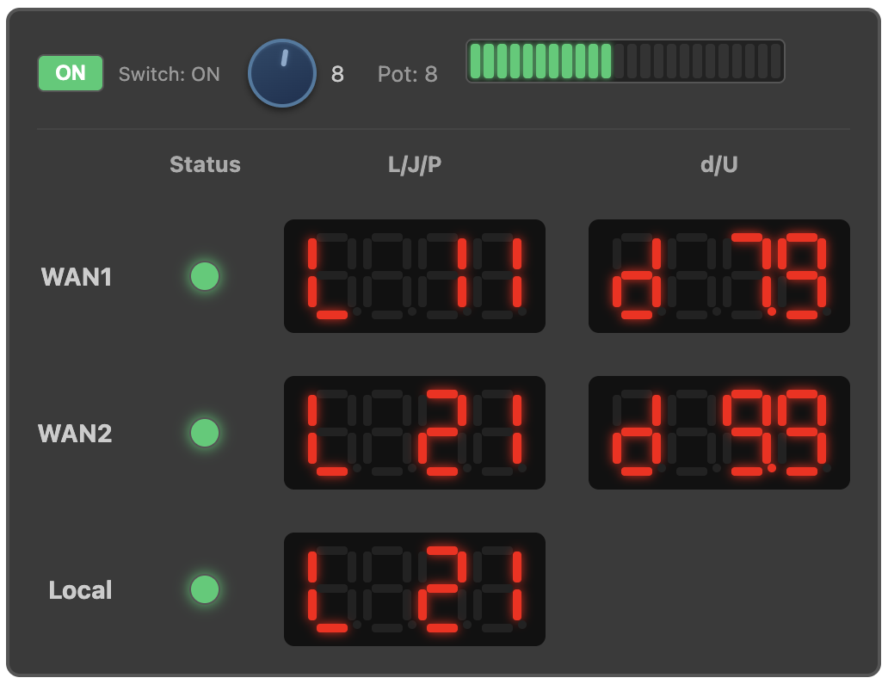

# wan-watcher

A physical WAN health indicator for pfSense using an ESP32.

wan-watcher collects real-time WAN metrics from pfSense (latency, loss, jitter, and bandwidth usage) and exposes them to an ESP32, which drives LEDs and 7-segment displays. The result is a small physical panel that shows your internet health at a glance.

## What it looks like



---

## Features

* **pfSense metrics collector**

  * Polls dpinger sockets for latency / jitter / loss
  * Auto-maps each dpinger instance to its WAN interface
  * Calculates per-WAN bandwidth usage (Mbps)
  * Writes clean status/metrics files in `/var/run` for consumers
  * Supports multiple dpinger instances (e.g., WAN + WAN2)
  * Tracks per-WAN state and usage separately
  * Regularly posts to ESP32 each WAN's state

* **ESP32 indicator panel**
  * Receives metrics via JSON API (`POST /api/wans` batch endpoint)
  * Bicolor LED indicators for WAN1, WAN2, and Local state (green=UP, yellow=DEGRADED, red=DOWN) via MCP23017 I2C expander
  * 24-segment bicolor LED bargraph showing data freshness:
    * 0–15s: green bar fills (fresh data)
    * 20–35s: yellow overwrites green (getting stale)
    * 40–55s: red overwrites yellow (stale)
    * 60s+: full red bar blinking + all WANs forced DOWN with blinking LEDs
  * Dual 7-segment displays per WAN:
    * **Packet display**: Shows latency (L), jitter (J), or packet loss (P)
    * **Bandwidth display**: Shows download (d) or upload (U) in Mbps
    * Displays show "----" when interface is DOWN or no data received
  * Button controls for display cycling:
    * Short press: advance to next metric
    * Long press: toggle auto-cycle mode
  * Auto-cycle enabled by default (5-second interval)
  * Physical power switch (toggle switch on MCP pin 13):
    * Turns all displays and LEDs on/off
    * Web UI can override; physical switch toggle overrides back
  * Brightness potentiometer (GPIO 36):
    * Analog dial controls brightness (0-15) for displays and status LEDs
    * Status LEDs use PWM with gamma correction for smooth dimming
    * Web UI slider can override; turning dial overrides back

* **Web UI**
  * Live-updating metrics table (refreshes every 5 seconds without page reload)
  * CSS-based 7-segment display panel mimicking the physical hardware layout
  * Virtual bicolor state LEDs for each interface (green/yellow/red matching hardware)
  * Freshness indicator bar (24 discrete LEDs matching hardware):
    * 0–15s: green bar fills (fresh data)
    * 20–35s: yellow overwrites green (getting stale)
    * 40–55s: red overwrites yellow (stale)
    * 60s+: full red bar blinking, displays show "----", WAN LEDs blink red
  * Click on displays to cycle metrics, auto-cycles every 5 seconds
  * Dynamic favicon color based on Local pinger state (green/yellow/red)
  * Local timezone display for timestamps
  * Display power toggle (syncs with physical switch, shows override status)
  * Brightness slider (0-15, syncs with potentiometer, shows override status)

* **ESP32 local pinger**

  * _Represents the controller’s independent view of internet reachability and may disagree with pfSense during routing or firewall faults._
  * ICMP pinger to configurable target (default 8.8.8.8)
  * Calculates latency, jitter, loss percentage (dpinger-style)
    * Averaged over a 60 second window with 120 samples (every 500ms)
  * Bicolor LED for local path (green=UP, yellow=DEGRADED, red=DOWN)
  * Separate 7-segment display for local packet stats (L/J/P)

## Failure Behavior

- If pfSense stops reporting: after 60 seconds, all WAN LEDs blink red, 7-segment displays read "----", freshness bar blinks red (local pinger continues updating independently)
- If ESP32 loses Ethernet: status LED blinks, last state retained

## Hardware

* 1× Olimex ESP32-POE-ISO
* 1× MCP23017 I2C GPIO expander (address 0x20)
* 5× Adafruit 4-digit 7-segment displays (HT16K33, addresses 0x71-0x75)
* 1× Adafruit Bicolor 24-Bar Bargraph w/I2C Backpack (HT16K33, address 0x70)
* 2× Momentary push buttons (active low, directly to MCP23017 with internal pull-ups)
* 3× Bicolor (green/red) LEDs for WAN status indicators (WAN1, WAN2, Local)

### I2C Wiring (Stemma QT / Qwiic)

| Signal | GPIO | Wire Color |
|--------|------|------------|
| SDA    | 13   | Blue       |
| SCL    | 16   | Yellow     |

### Pin Mapping

| Pin | Type | Function |
|-----|------|----------|
| MCP 0 | MCP23017 | WAN1 Green LED |
| MCP 1 | MCP23017 | WAN1 Red LED |
| MCP 2 | MCP23017 | WAN2 Green LED |
| MCP 3 | MCP23017 | WAN2 Red LED |
| MCP 4 | MCP23017 | Local Green LED |
| MCP 5 | MCP23017 | Local Red LED |
| MCP 7 | MCP23017 | Ethernet status LED |
| MCP 13 | MCP23017 | Power switch (INPUT_PULLUP, active low) |
| MCP 14 | MCP23017 | Packet display button (INPUT_PULLUP) |
| MCP 15 | MCP23017 | Bandwidth display button (INPUT_PULLUP) |
| GPIO 14 | ESP32 | Status LED PWM brightness (transistor base) |
| GPIO 36 | ESP32 | Brightness potentiometer (ADC1, analog input) |

**Bicolor LED states:** Green = UP, Both on (yellow/amber) = DEGRADED, Red = DOWN

### Display I2C Addresses

| Address | Display |
|---------|---------|
| 0x70 | Freshness Bar (24-segment bicolor) |
| 0x71 | WAN1 Packet (L/J/P) |
| 0x72 | WAN1 Bandwidth (d/U) |
| 0x73 | WAN2 Packet (L/J/P) |
| 0x74 | WAN2 Bandwidth (d/U) |
| 0x75 | Local Packet (L/J/P) |

## Repository Structure

```
wan-watcher/
  pf/            # pfSense scripts (cron polling, dpinger, usage)
  esp32/         # ESP32 firmware (LEDs, 7-seg, API endpoints)
  README.md
  .gitignore
```

---

## ESP32 Network Configuration

The ESP32 connects via Ethernet using the Olimex ESP32-POE-ISO's built-in LAN8720 PHY.

The device uses the hostname `wan-watcher` and exposes itself via mDNS (Bonjour/Avahi):

```
http://wan-watcher.local/
```

Your OS must support mDNS for this to work (macOS: built-in, Linux: Avahi, Windows: Bonjour).

---

## Installation (pfSense)

### 1. Install the daemon

```sh
cp pf/wan_watcher_daemon.sh /usr/local/bin/
chmod +x /usr/local/bin/wan_watcher_daemon.sh
```

### 2. Install Shellcmd

pfSense Web UI:

* **System → Package Manager → Available Packages**
* Install **Shellcmd**

### 3. Add a startup entry

pfSense Web UI:

* **Services → Shellcmd → Add**

Set:

* **Command:**

  ```sh
  /usr/sbin/daemon -f -p /var/run/wan_watcher.pid sh -c '/usr/local/bin/wan_watcher_daemon.sh >> /var/log/wan_watcher.log 2>&1'
  ```
* **Type:** `shellcmd`

Save.

### 4. Start it now (optional)

Shellcmd runs at boot. To start without rebooting:

```sh
/usr/sbin/daemon -f -p /var/run/wan_watcher.pid sh -c '/usr/local/bin/wan_watcher_daemon.sh >> /var/log/wan_watcher.log 2>&1'
```

### 5. Verify

```sh
cat /var/run/wan_watcher.pid
ps -p $(cat /var/run/wan_watcher.pid)
tail -f /var/log/wan_watcher.log
```

#### Stop / restart

```sh
kill "$(cat /var/run/wan_watcher.pid)"
/usr/sbin/daemon -f -p /var/run/wan_watcher.pid sh -c '/usr/local/bin/wan_watcher_daemon.sh >> /var/log/wan_watcher.log 2>&1'
```

---

## JSON API (ESP32)

The ESP32 exposes a JSON API for metrics:

**Endpoints:**
- `POST /api/wans` - Batch update for all WANs (used by pfSense daemon)
- `GET /api/status` - Get current metrics for all interfaces (used by Web UI)
- `GET /api/display-power` - Get display/LED power state and physical switch position
- `POST /api/display-power` - Set display/LED power state
- `GET /api/brightness` - Get display brightness level and potentiometer position
- `POST /api/brightness` - Set display brightness level (0-15)

### POST /api/wans

**Payload format:**
```json
{
  "router_ip": "192.168.1.1",
  "timestamp": "2025-01-15T10:30:00Z",
  "wan1": {
    "state": "up",
    "loss_pct": 0,
    "latency_ms": 6,
    "jitter_ms": 0,
    "down_mbps": 2.0,
    "up_mbps": 3.3,
    "local_ip": "100.64.1.5",
    "gateway_ip": "100.64.1.1",
    "monitor_ip": "8.8.8.8"
  },
  "wan2": {
    "state": "up",
    "loss_pct": 0,
    "latency_ms": 12,
    "jitter_ms": 1,
    "down_mbps": 50.0,
    "up_mbps": 10.0,
    "local_ip": "192.168.100.2",
    "gateway_ip": "192.168.100.1",
    "monitor_ip": "1.1.1.1"
  }
}
```

**Example:**
```
curl -X POST -H "Content-Type: application/json" \
  -d '{"router_ip":"192.168.1.1","timestamp":"2025-01-15T10:30:00Z","wan1":{"state":"up","loss_pct":0,"latency_ms":6,"jitter_ms":0,"down_mbps":2.0,"up_mbps":3.3,"local_ip":"100.64.1.5","gateway_ip":"100.64.1.1","monitor_ip":"8.8.8.8"}}' \
  http://wan-watcher.local/api/wans
```

### GET /api/status

Returns current metrics for all interfaces. Used by the Web UI for live updates.

**Response format:**
```json
{
  "timestamp": "2025-01-15T10:30:00Z",
  "router_ip": "192.168.1.1",
  "wan1": {
    "state": "up",
    "latency_ms": 6,
    "jitter_ms": 0,
    "loss_pct": 0,
    "down_mbps": 2.0,
    "up_mbps": 3.3,
    "monitor_ip": "8.8.8.8",
    "gateway_ip": "100.64.1.1",
    "local_ip": "100.64.1.5"
  },
  "wan2": { ... },
  "local": {
    "state": "up",
    "latency_ms": 12,
    "jitter_ms": 1,
    "loss_pct": 0
  }
}
```

### GET /api/display-power

Returns current display/LED power state and physical switch position.

**Response format:**
```json
{
  "on": true,
  "switch_position": true
}
```

- `on`: Current power state (software-controlled)
- `switch_position`: Physical toggle switch position (true = ON)

When `on` differs from `switch_position`, the web UI shows "(overridden)" to indicate the software state differs from the physical switch.

### POST /api/display-power

Set the display/LED power state (overrides physical switch until switch is toggled).

**Payload format:**
```json
{
  "on": true
}
```

### GET /api/brightness

Returns current brightness level and potentiometer position.

**Response format:**
```json
{
  "brightness": 8,
  "pot_level": 10
}
```

- `brightness`: Current display brightness (0-15, software-controlled)
- `pot_level`: Physical potentiometer position (0-15)

When `brightness` differs from `pot_level`, the web UI shows "(overridden)" to indicate the software setting differs from the dial position.

### POST /api/brightness

Set the display brightness (overrides potentiometer until dial is turned).

**Payload format:**
```json
{
  "brightness": 8
}
```

## Security Notes

- Intended for a trusted VLAN
- No authentication by default
- Do not expose the ESP32 API to untrusted networks

## TODOs:

- make a matching web ui toggle switch to look like the hardware toggle
- include photos of the pysical panel

## License

MIT

## Contributions

This is a hobby/utility project. Suggestions welcome as it evolves.
